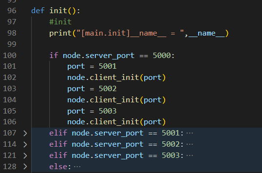
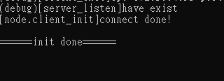

### 用法

#### windows下啟動

```bat=
run.bat
```

#### 啟動流程

run.bat -> driver.py -> runner.py (*4，依照driver裡面設定的數量) -> main.py

至此就會開啟四個節點

### 指令

程式啟動後目前有兩種模式
1. 一般指令模式
2. 惡意攻擊模式

在一般指令模式下可以由使用者在主控台輸入指令字串進行操控
    
1. `exit,x`
    > 結束程式
2. `show blockchain`
    > 在主控台上顯示帳本內容，並且入log
3. `show blockqueue`
    > 顯示代挖佇列物件
4. `show block`
    > 縣市代挖佇列區塊內容
5. `new block,nb`
    > 自動產生區塊，主要是debug所使用
6. `show serverlist`
    > 顯示 node 的server物件列表
7. `show clientlist
    > 顯示 node 的client物件列表
8. `show others ledge,ol`
    > 顯示 別人傳過來的帳本
9. `send`
    > 廣播帳本給別人
10. `pause`
    > 全系統暫停
11. `resume,rs`
    > 全系統從暫停恢復運行
12. `status,st`
    > 顯示狀態
13. `send data`
    > 廣播在本地的data
14. `data`
    > 傳送在本地的data
15. `test`
    > 測試用途
16. `show memberlist`
    > 顯示node的整合後節點資訊
17. `GCS_ledge`
    > 傳送帳本給ground control station

### 系統架構簡介

* 專案目錄
    > 主要存放啟動用程式
    * 有使用
        1. run.bat: 在windows下執行會啟動driver.py
        2. driver.py: 啟動後會開4個執行緒，每個執行緒都會執行runner.py
        3. runner.py: 有兩種模式可以執行main.py
            1. stdout在終端上
            2. 寫在./log/port裡面
                > 還需要分ip，因為目前我都只需要用port來區分不同節點
        4. data.bin.txt: 來自無人機的資料
    * 沒有使用
        1. update.py: 之前寫紀錄用的
        2. Parser.cpp: 廢棄
        3. bug.txt: 之前debug用的
        4. temp.log: 之前debug用的
* ./main目錄
    > 主要存放節點大部分使用到的程式
    * 有使用
        1. main.py: 進入點
        2. blockchain.py: 區塊鏈程式，main.py會宣告一個Blockcahin實例
        3. block.py: 區塊定義
        4. node.py: 所有通訊會透過這個程式，實現通訊依靠socket模組 
        5. specification.py: node收到資料後會直接使用此程式解析，解析格式在./format/ 裡面
        6. data_parser.py:
            1. DataParser物件:
                1. Check方法: 檢查是否有無人機的資料(data.bin.txt)，若有則直接呼叫Parser方法並且回傳結果
                2. Parser方法: 解析資料
    * 沒有使用
        1. appendix.py
* ./lib
    > lib
    * 有使用
        1. mylib.py: 定義函式庫
            1. myNonBlockingInput物件: 實現非阻塞讀取stdin，目前用在節點皆換成惡意攻擊模式時不能使用阻塞input
* ./format
    > 記錄各個資料格式

#### 全系統架構圖參考


#### 各行程運行介紹

* 啟動程式後，主程式會依照下圖

    
    的方式呼叫`node.client_init(port)`進行連線

* 等待全部就緒後，會進入指令互動模式
    
    

    在main.py之中，進入無窮迴圈，利用UserInput()函數已非阻塞的方式讀取stdin
    此無窮迴圈會判斷STOP這個全域變數決定是否要終止，


