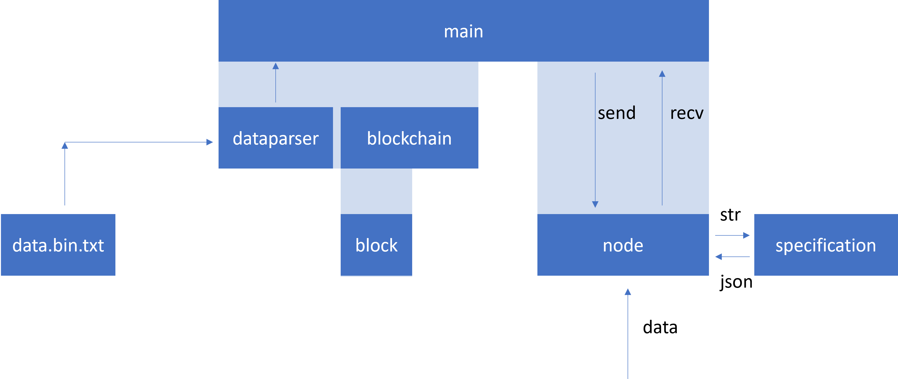

### 用法

#### windows下

```bat=
run.bat
```

#### 啟動流程

run.bat -> driver.py -> runner.py (*4，依照driver裡面設定的數量) -> main.py

至此就會開啟四個節點

### 系統架構簡介

* 專案目錄
    > 主要存放啟動用程式
    * 有使用
        1. run.bat: 在windows下執行會啟動driver.py
        2. driver.py: 啟動後會開4個執行緒，每個執行緒都會執行runner.py
        3. runner.py: 有兩種模式可以執行main.py
            1. stdout在終端上
            2. 寫在./log/port裡面
                > 還需要分ip，因為目前我都只需要用port來區分不同節點
        4. data.bin.txt: 來自無人機的資料
    * 沒有使用
        1. update.py: 之前寫紀錄用的
        2. Parser.cpp: 廢棄
        3. bug.txt: 之前debug用的
        4. temp.log: 之前debug用的
* ./main目錄
    > 主要存放節點大部分使用到的程式
    * 有使用
        1. main.py: 進入點
        2. blockchain.py: 區塊鏈程式，main.py會宣告一個Blockcahin實例
        3. block.py: 區塊定義
        4. node.py: 所有通訊會透過這個程式，實現通訊依靠socket模組 
        5. specification.py: node收到資料後會直接使用此程式解析，解析格式在./format/ 裡面
        6. data_parser.py:
            1. DataParser物件:
                1. Check方法: 檢查是否有無人機的資料(data.bin.txt)，若有則直接呼叫Parser方法並且回傳結果
                2. Parser方法: 解析資料
    * 沒有使用
        1. appendix.py
* ./lib
    > lib
    * 有使用
        1. mylib.py: 定義函式庫
            1. myNonBlockingInput物件: 實現非阻塞讀取stdin，目前用在節點皆換成惡意攻擊模式時不能使用阻塞input
* ./format
    > 記錄各個資料格式

#### 全系統架構圖參考



各形成運行介紹

* 啟動程式後，會依照下圖

    
    的方式呼叫`node.client_init(port)`進行連線

* 等待全部就緒後，會進入指令互動模式
    
    

    在main.py之中，進入無窮迴圈，利用UserInput()函數已非阻塞的方式讀取stdin
    此無窮迴圈會判斷STOP這個全域變數決定是否要終止，


